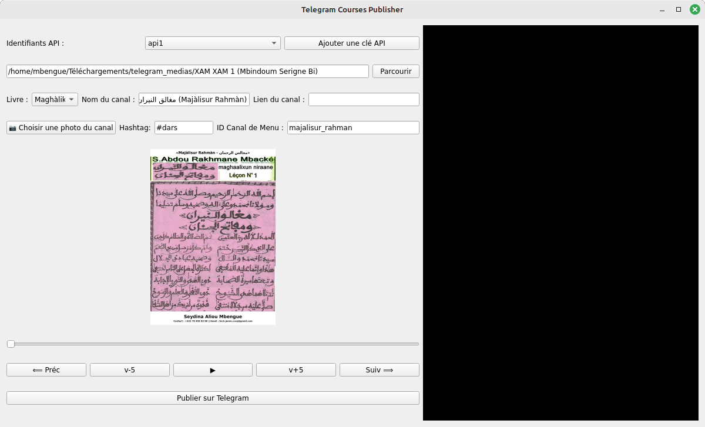
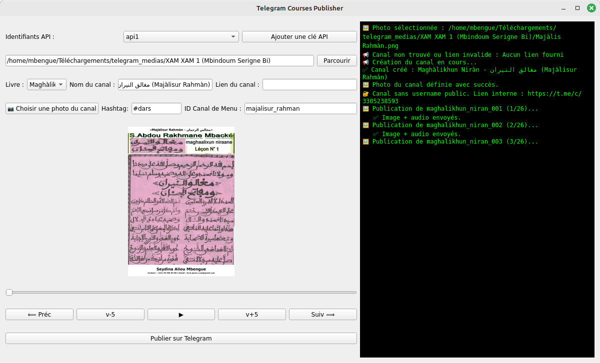
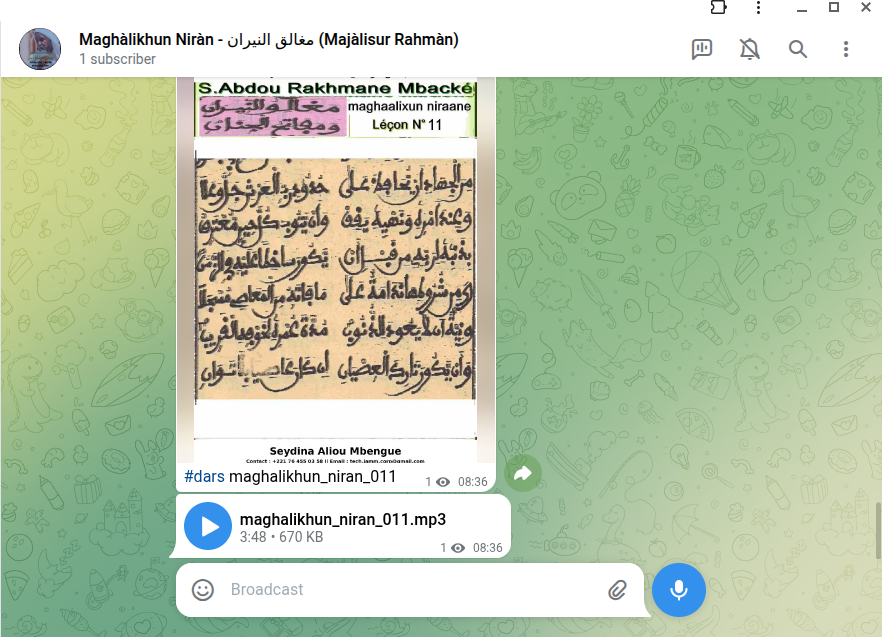

# 📚 Telegram Course Publisher

Automatisez la publication de cours (images, audios, vidéos et autres médias) dans un canal Telegram, avec mise à jour automatique d’un **canal principal** servant de menu général des formations.

---

## 📌 Description

**Telegram Course Publisher** est une application Python / PyQt développée pour :

* Créer automatiquement un canal Telegram dédié à un cours
* Publier de manière ordonnée toutes les images et audios correspondant aux leçons
* Ajouter des légendes personnalisées (ex : `#dars NomFichier`)
* Mettre à jour un **canal principal** (optionnel) contenant un menu regroupant tous les canaux de cours créés
* Gérer plusieurs clés API (`api_id` / `api_hash`)
* Afficher un journal (log) des opérations en direct

Le projet utilise **Telethon** pour communiquer avec l'API Telegram et offre une interface simple pour automatiser les publications de cours.

---

## 🖼️ Captures d'écran

| Interface     | Aperçu                                  |
| ------------- | --------------------------------------- |
| **Capture 1** |  |
| **Capture 2** |  |
| **Capture 3** |  |

---

## 🛠️ Fonctionnalités principales

### 📤 Publication automatique

* Envoi des images et audios dans l’ordre (leçon 001, 002…)
* Ajout automatique de tags dans la légende (`#dars`)
* Support des fichiers `config`, images et audios associés à chaque cours

### 📡 Gestion des canaux Telegram

* Création d’un canal **public** avec normalisation du nom (suppression d'accents, espaces, caractères spéciaux)
* Ajout d’une biographie composée du nom du canal + nom arabe issu du fichier de configuration
* Mise à jour automatique du **menu principal des cours** dans un canal dédié

### 🧩 Interface PyQt complète

* Sélection du dossier contenant les cours
* Choix de la clé API à utiliser
* Vue de prévisualisation de la première image/audio
* Bouton “Envoyer les médias”
* Journal des opérations en direct (log)

### 🔑 Gestion des API Telegram

* Ajout d’une API (`api_id`, `api_hash`)
* Sélection d’une API parmi celles enregistrées
* Stockage dans `api_keys.json`

---

## 📦 Installation

Clonez le projet :

```bash
git clone git@github.com:aliou90/Telegram-Course-Publisher.git
cd Telegram-Course-Publisher
```

Installez les dépendances :

```bash
# Création et/ou activation du VENV
python3 -m venv venv
source venv/bin/activate   # Linux/Mac
# ou venv\Scripts\activate  # Windows
pip install -r requirements.txt
```

---

## ▶️ Lancement de l'application

```bash
python app.py
```

---

## 📁 Organisation des dossiers

Un dossier de cours doit être structuré comme suit :

```
MonCours/
│── images/
│     ├── 001.png
│     ├── 002.png
│     └── ...
│
│── audios/
│     ├── 001.mp3
│     ├── 002.mp3
│     └── ...
│
└── config/
      └── config.json
```

Exemple de `config.json` :

```json
{
    "nomArabe": "مجالس الرحمان",
    "titre": "Mawahibun Nafih"
}
```

---

## 🧠 Fonctionnement du menu principal

Si un **canal principal** est renseigné dans l'application :

* Le bot vérifie s’il existe un message listant les anciennes formations
* Sinon il le crée
* Ensuite il **met à jour automatiquement** la liste avec le nouveau canal de cours publié

Exemple :

```
📚 Liste des formations :

1️⃣ Mawàhibu Nàfih  
🔗 https://t.me/+M5ONPObIG844M2Nk
2️⃣ Tazawudus Sixàr
🔗 https://t.me/+tsY-uj5eOBJlMzdk
3️⃣ Canal Principal (Menu des canaux)
🔗 https://t.me/majalisur_rahman

```

---

## 🧑‍💻 Auteur

**Aliou Mbengue**
👉 GitHub : [https://github.com/aliou90](https://github.com/aliou90)


